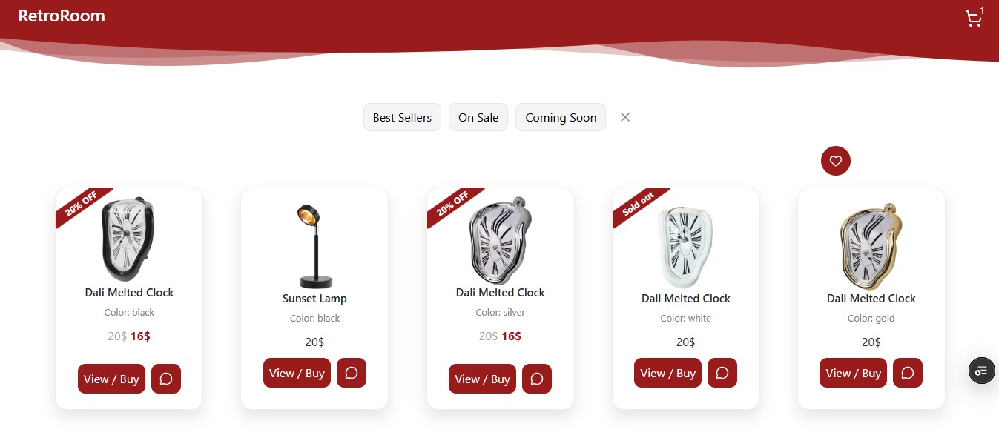
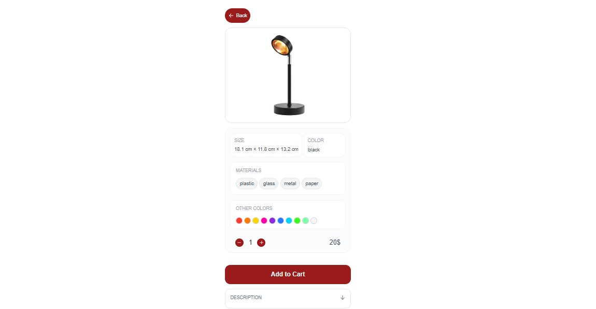
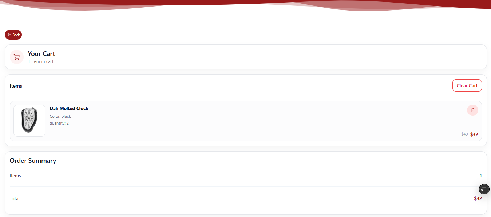
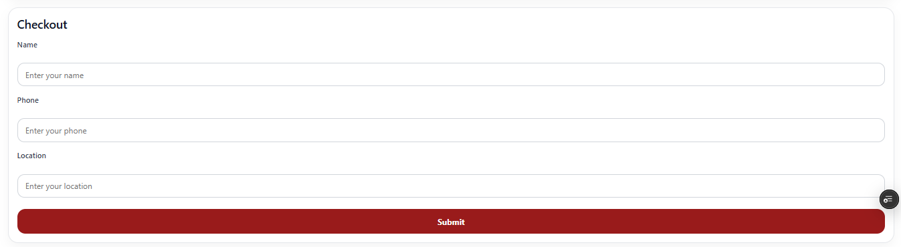
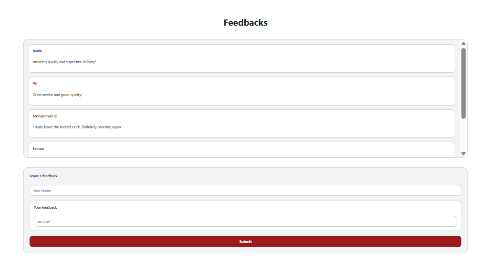

# CSCI390: Web Application Project

### Assignment 42430057 | Lebanese International University (LIU)

**Developer:** Hanin

---

## Description

This repository contains a modern web application developed as part of the **CSCI390 Web Application Development** course at **Lebanese International University (LIU)**.

> **Current Status:**
> This project currently works as a standalone frontend web application, with data handled locally in the browser. A backend server and database may be added in future updates.

**Live Deployment:** [View the Live Web App on Vercel](https://assignment-42430057.vercel.app/)

> **Note:** Since the application is hosted on a free deployment tier, the first page load may take a few seconds to load.

---

## Setup Instructions

Follow the steps below to clone, install, and run the project locally on a Windows machine.

### 1. Clone the Repository and Navigate to the Project Folder

Open a terminal then clone into the repo

### 2. Install Dependencies

Install npm packages:

```bash
npm install
```

### 3. Running the app

#### Development Mode

```bash
npm run start
```

The application will open in your browser at:

```bash
http://localhost:3000
```

#### Production Mode

To generate and preview the optimized production build locally, run:

```bash
npm run build
```

Then serve the generated build folder using `serve`:

```bash
npm install -g serve
serve -s build
```

> Or, the generated `build` folder can be served through an Express.js backend server.

---

# Screenshots of the UI

## Home Page



## Product Details Page



## Cart Page



## Checkout Part



## Feedbacks Page



